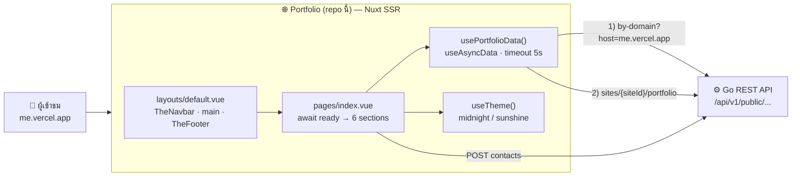
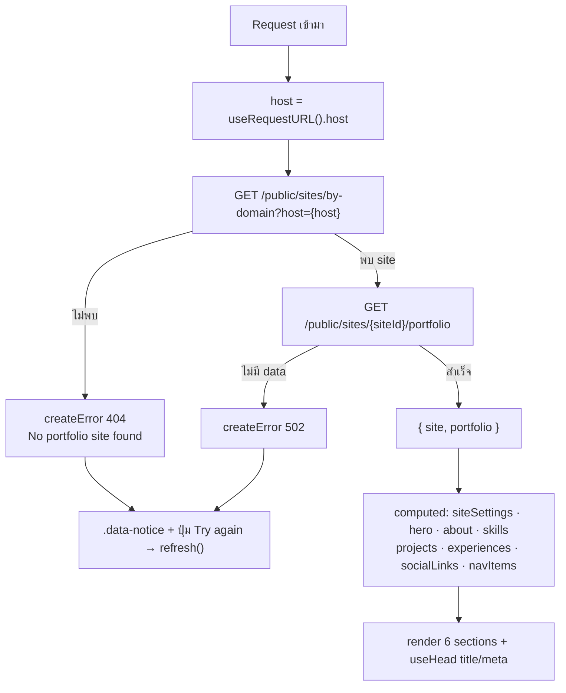

<div align="center">

# Portfolio

**เว็บ portfolio หน้าบ้านที่เนื้อหาทั้งหมดมาจาก CMS ตาม domain ที่เปิด — instance เดียว deploy ได้หลาย domain**

One codebase, many portfolios. Content-driven, SSR, themeable.

[](https://nuxt.com)
[](https://vuejs.org)
[](https://www.typescriptlang.org)
[](https://tailwindcss.com)
[](https://threejs.org)
[](#-สถาปัตยกรรม)
[](https://vercel.com)

[ฟีเจอร์](#-ฟีเจอร์) ·
[เริ่มต้นใช้งาน](#-เริ่มต้นใช้งาน) ·
[สถาปัตยกรรม](#-สถาปัตยกรรม) ·
[Theme](#-ระบบ-theme) ·
[โครงสร้างโปรเจกต์](#-โครงสร้างโปรเจกต์) ·
[Deploy](#-deploy-บน-vercel) ·
[เอกสาร](#-เอกสารเพิ่มเติม)

</div>

---

## 🧩 ระบบนี้ประกอบด้วยอะไร

Repo นี้เป็น **1 ใน 3 ส่วน** ของระบบ Multi-Site Portfolio ทั้ง 3 repo ต่อกันด้วย REST API และ contract `site_id`

| Repo | หน้าที่ | Stack | Port dev |
|---|---|---|---|
| [ADMIN_API_CONFIG](https://github.com/RujikornTonkaow/ADMIN_API_CONFIG) | Backend REST API + MongoDB | Go 1.22 · MongoDB 7 · JWT | 8080 |
| [Admin_Websie_Config](https://github.com/RujikornTonkaow/Admin_Websie_Config) | Admin dashboard จัดการ sites / users / content | Nuxt 3 (SPA) · Tailwind · i18n | 3001 |
| **Portfolio** (repo นี้) | เว็บ portfolio หน้าบ้าน แสดงเนื้อหาตาม domain | Nuxt 3 (SSR) · Tailwind · Three.js | 3000 |

เว็บนี้ **ไม่มี auth, ไม่มี database, ไม่มี CMS ในตัว** — ทุกอย่างดึงจาก backend ตอน render

---

## ✨ ฟีเจอร์

| | ฟีเจอร์ | รายละเอียด |
|---|---|---|
| 🌐 | **แสดง portfolio ตาม domain** | อ่าน `host` ของ request → ถาม backend ว่า host นี้คือ site ไหน → ดึงเนื้อหาของ site นั้น deploy ครั้งเดียวใช้ได้หลายโดเมน |
| ⚡ | **SSR** | render HTML ที่ server ก่อน (SEO, `<title>` / meta จาก CMS) แล้ว hydrate ฝั่ง client |
| 🧱 | **6 Sections** | Hero (+ Three.js sculpture), About (bio, tags, stats), Projects (filter ตาม tag), Skills (grid ตาม category), Experience (timeline), Contact (form POST ไป backend) |
| 🎨 | **Theme 2 แบบ** | `midnight` (มืด) / `sunshine` (สว่าง) — default มาจาก CMS ผู้ใช้ toggle ได้และจำไว้ใน `localStorage` ไม่มี FOUC |
| 🧊 | **Three.js sculpture** | torus-knot แบบ wireframe ใน hero ตอบสนอง pointer client-only และ fail-safe ถ้าไม่มี WebGL |
| 🛡️ | **ทนต่อ API ล่ม** | timeout 5 วินาที ไม่ retry อัตโนมัติ แสดง error notice + ปุ่ม "Try again" แทนที่จะค้าง |
| 🖼️ | **รูปจาก CMS** | profile และ project image ผ่าน `getImageUrl()` มี placeholder เมื่อรูปพัง |
| ♿ | **a11y** | skip link, active section ด้วย IntersectionObserver, mobile menu ปิดด้วย Esc |
| 🧪 | **Render test** | จำลอง API ด้วย `node:http` แล้ว spawn Nuxt ตรวจว่าหน้าเปลี่ยนตาม CMS จริง และไม่ hang เมื่อ API ล่ม |

<!--
📸 Screenshots — วางรูปไว้ที่ docs/screenshots/ แล้วเปิดคอมเมนต์นี้
<div align="center">
  
  
</div>
-->

---

## 🚀 เริ่มต้นใช้งาน

### สิ่งที่ต้องมี

- Node.js 20 ขึ้นไป
- Backend [ADMIN_API_CONFIG](https://github.com/RujikornTonkaow/ADMIN_API_CONFIG) รันอยู่ที่ `http://localhost:8080` (seed ของ backend ผูก domain `localhost:3000` ไว้ให้แล้ว)

### ติดตั้งและรัน

```bash
# 1. Clone
git clone https://github.com/RujikornTonkaow/Portfolio.git
cd Portfolio

# 2. ติดตั้ง dependencies (postinstall จะรัน nuxt prepare)
npm install

# 3. ตั้งค่า environment variables
cp .env.example .env

# 4. เริ่ม dev server
npm run dev
```

เปิด `http://localhost:3000` — เนื้อหาที่เห็นคือข้อมูล seed ของ backend แก้ได้จาก admin dashboard

> 💡 ถ้าเจอ 404 **"No portfolio site found for localhost:3000"** แสดงว่า backend ไม่มี site ที่มี domain นี้ ให้เพิ่มใน `sites.domains` ผ่าน admin dashboard (เก็บเฉพาะ host ไม่มี `http://`)

### Environment Variables

| ตัวแปร | คำอธิบาย |
|---|---|
| `NUXT_PUBLIC_API_BASE_URL` | origin ของ backend เช่น `http://localhost:8080` — ใช้ทั้ง resolve site, ดึงเนื้อหา, ส่ง contact และประกอบ URL รูป |

### Scripts

| คำสั่ง | ทำอะไร |
|---|---|
| `npm run dev` | เริ่ม dev server ที่ `http://localhost:3000` |
| `npm run build` | SSR build ลง `.output/` |
| `npm run generate` | static build (ระวัง: by-domain จะถูก resolve ตอน generate) |
| `npm run preview` | เปิด build ที่ได้ |
| `npm run typecheck` | `nuxt prepare && vue-tsc --noEmit` |
| `npm run test:render` | render test กับ fake API (`tests/portfolio-render.test.mjs`) |

---

## 🏗️ สถาปัตยกรรม



### Data flow



ทุก section เรียก `usePortfolioData()` ซ้ำได้โดยไม่ยิง request ใหม่ เพราะใช้ `useAsyncData` key เดียวกันต่อ host

### Tech stack

| ส่วน | เทคโนโลยี |
|---|---|
| Framework | Nuxt 3.17 · SSR · `useAsyncData` · `useHead` · `useRequestURL` |
| UI | Vue 3.5 Composition API (`<script setup lang="ts">`) |
| ภาษา | TypeScript 5.8 · type check ด้วย `vue-tsc` |
| Styling | Tailwind CSS ผ่าน `@nuxtjs/tailwindcss` + CSS variables สำหรับ theme |
| 3D | Three.js 0.186 (`HeroSculpture.client.vue`, client-only, lazy) |
| Icons | Iconify ผ่าน `@nuxt/icon` + `@iconify-json/logos`, `@iconify-json/mdi` (ชื่อ icon มาจาก CMS เช่น `logos:vue`) |
| Fonts | Google Fonts Inter + JetBrains Mono |
| Test | Node built-in `node:test` |
| Format | Prettier |
| Backend | Go REST API (repo แยก) ผ่าน `NUXT_PUBLIC_API_BASE_URL` |
| Hosting | Vercel |

### API contract ที่ต้องการจาก backend

| Method | Path | ใช้ตอน |
|---|---|---|
| `GET` | `/api/v1/public/sites/by-domain?host=<host>` | ทุกครั้งที่โหลดหน้า (SSR) |
| `GET` | `/api/v1/public/sites/{siteId}/portfolio` | ต่อจาก by-domain |
| `POST` | `/api/v1/public/sites/{siteId}/portfolio/contacts` | ส่ง contact form |
| `GET` | `/uploads/{file}` | รูป profile / project |

- Response: `{ "data": {...} }` หรือ `{ "error": "..." }`
- `portfolio` มี `site_settings`, `hero`, `about`, `skills[]`, `projects[]`, `experiences[]`, `social_links[]`, `nav_items[]`
- `host` ส่งแบบ exact เช่น `localhost:3000` (รวม port) และ backend เก็บ `sites.domains` แบบเดียวกัน

รายละเอียด field ครบทุกตัวอยู่ใน [`PORTFOLIO_FRONTEND_SPEC.md`](./PORTFOLIO_FRONTEND_SPEC.md)

---

## 🎨 ระบบ Theme

3 ชั้นทำงานร่วมกัน

| ชั้น | ไฟล์ | ทำอะไร |
|---|---|---|
| CSS variables | `assets/css/tailwind.css` | `html.midnight { --t-bg: 17 19 16; ... }` / `html.sunshine { ... }` (ค่า `R G B` เพื่อรองรับ alpha) |
| Tailwind mapping | `tailwind.config.ts` | `th-bg: rgb(var(--t-bg) / <alpha-value>)` → ใช้ `bg-th-bg text-th-fg border-th-edge/20` ได้ |
| Composable | `composables/useTheme.ts` | ใส่ class บน `<html>`, sync กับ CMS default ผ่าน `updated_at`, toggle + persist ใน `localStorage` |

Inline script ใน `<head>` อ่าน theme จาก `localStorage` ก่อน paint จึงไม่มี FOUC
ถ้า CMS เปลี่ยน `default_theme` (version `updated_at` เปลี่ยน) theme ของผู้ใช้จะถูก reset เป็นค่าใหม่

วิธีเพิ่ม theme ใหม่อยู่ใน [`GUIDE/05-THEMING-GUIDE.md`](./GUIDE/05-THEMING-GUIDE.md)

---

## 📂 โครงสร้างโปรเจกต์

```
Portfolio/
├── app.vue                         # <NuxtLayout><NuxtPage/>
├── nuxt.config.ts                  # modules, runtimeConfig, head (fonts + theme inline script)
├── tailwind.config.ts              # font, palette, th-* colors ผูก CSS vars, animations
├── assets/css/tailwind.css         # CSS variables ของ 2 theme + component classes
├── pages/index.vue                 # หน้าเดียว: await ready, useHead, ประกอบ sections
├── layouts/default.vue             # skip link + TheNavbar + main + TheFooter
├── components/
│   ├── TheNavbar.vue  TheFooter.vue  ThemeToggle.vue  ProfileAvatar.vue
│   ├── SectionHero.vue  SectionAbout.vue  SectionProjects.vue
│   ├── SectionSkills.vue  SectionExperience.vue  SectionContact.vue
│   └── HeroSculpture.client.vue    # Three.js (client-only)
├── composables/
│   ├── usePortfolioData.ts         # ดึงข้อมูลทั้งหมด (หัวใจของ repo)
│   └── useTheme.ts
├── types/portfolio.ts              # types ต้องตรงกับ model.go ของ backend
├── tests/portfolio-render.test.mjs # integration render test
├── public/images/                  # รูป fallback (profile.jpg)
├── GUIDE/                          # เอกสารเชิงลึก 01..07
├── PORTFOLIO_FRONTEND_SPEC.md      # API contract ที่ frontend ต้องการ
└── .env.example
```

### กติกาก่อนแก้โค้ด

- **ข้อมูลทุกอย่างต้องมาจาก `usePortfolioData()`** ห้าม hardcode เนื้อหาใน component
- **ห้ามจำกัดจำนวน item** (เช่น slice 6 projects) — render ตาม API ทั้งหมด
- **รูปทุกรูปต้องผ่าน `getImageUrl()`** เพราะ DB เก็บ path relative
- **สีต้องใช้ `th-*` classes หรือ CSS vars** ห้ามใช้สี fix เพื่อให้ทั้ง 2 theme ถูก
- **โค้ดที่ใช้ `window` / `document`** ต้องอยู่ใน `onMounted`, `import.meta.client` หรือ component `.client.vue` เพราะเป็น SSR
- **เพิ่ม field ใหม่จาก CMS** ต้องแก้ 3 ที่: backend `model.go` → `types/portfolio.ts` → component และอัปเดต `PORTFOLIO_FRONTEND_SPEC.md`
- หลังแก้เสร็จรัน `npm run typecheck` และ `npm run test:render`

---

## ☁️ Deploy บน Vercel

1. Import repo นี้ที่ [vercel.com](https://vercel.com) — Framework Preset เลือก **Nuxt.js**
2. ตั้ง Environment Variable `NUXT_PUBLIC_API_BASE_URL` เป็น URL ของ backend production (เช่น `https://admin-api-config.onrender.com`)
3. กด Deploy แล้วนำ domain ที่ได้ (เช่น `xxx.vercel.app`) ไป**เพิ่มใน `sites.domains` ของ site ผ่าน admin dashboard** — ถ้าไม่เพิ่มจะได้ 404 "No portfolio site found"
4. CORS ฝั่ง backend จะอนุญาต domain ใหม่เองภายใน 5 นาที (หรือ restart backend)

จะผูก custom domain กี่โดเมนก็ได้ ขอแค่แต่ละ domain อยู่ใน `sites.domains` ของ site ที่ต้องการแสดง

---

## 📚 เอกสารเพิ่มเติม

| ไฟล์ | เนื้อหา |
|---|---|
| [`PORTFOLIO_FRONTEND_SPEC.md`](./PORTFOLIO_FRONTEND_SPEC.md) | API contract ทุก field (สำคัญที่สุดเมื่อคุยกับ backend) |
| [`GUIDE/01-SYSTEM-FLOW.md`](./GUIDE/01-SYSTEM-FLOW.md) | lifecycle, data / theme / contact / navigation / image flow |
| [`GUIDE/02-FILE-REFERENCE.md`](./GUIDE/02-FILE-REFERENCE.md) | อธิบายทุกไฟล์ |
| [`GUIDE/03-TECH-STACK.md`](./GUIDE/03-TECH-STACK.md) | เทคโนโลยี + เหตุผล |
| [`GUIDE/04-GETTING-STARTED.md`](./GUIDE/04-GETTING-STARTED.md) | เริ่มต้นใช้งาน |
| [`GUIDE/05-THEMING-GUIDE.md`](./GUIDE/05-THEMING-GUIDE.md) | CSS vars, Tailwind mapping, เพิ่ม theme |
| [`GUIDE/06-COMPONENT-PATTERNS.md`](./GUIDE/06-COMPONENT-PATTERNS.md) | pattern การเขียน component |
| [`GUIDE/07-UI-RENOVATION.md`](./GUIDE/07-UI-RENOVATION.md) | บันทึกการ redesign ล่าสุด (editorial layout, Three.js) |

---

## 👥 ผู้พัฒนา

- [@RujikornTonkaow](https://github.com/RujikornTonkaow)

## 📄 License

โปรเจกต์นี้ยังไม่ได้ระบุ license — เพิ่มไฟล์ `LICENSE` ได้ตามต้องการ (เช่น MIT)

<div align="center">
<sub>Built with Nuxt · Three.js · Tailwind · ☕</sub>
</div>
